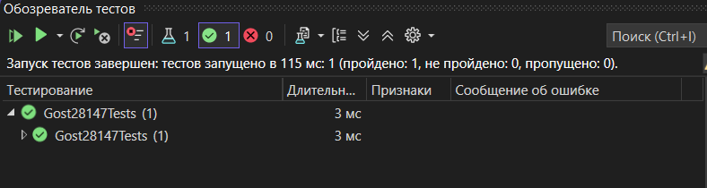
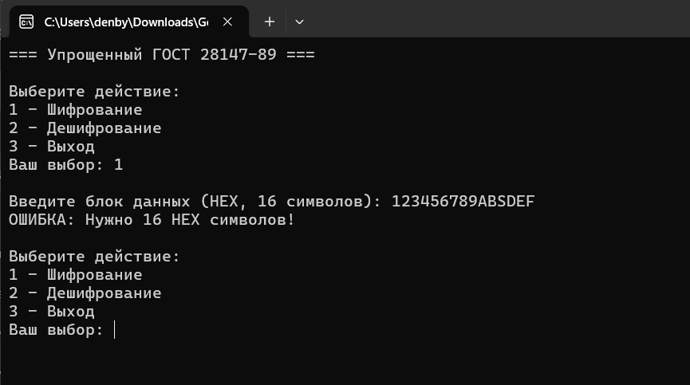
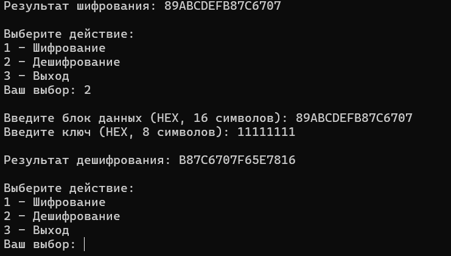
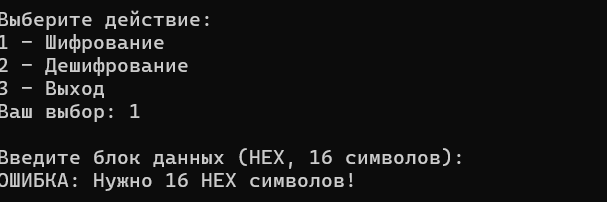
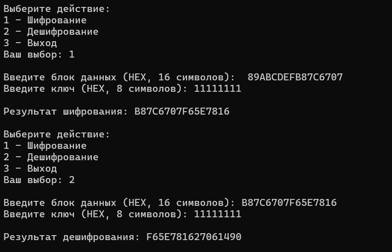
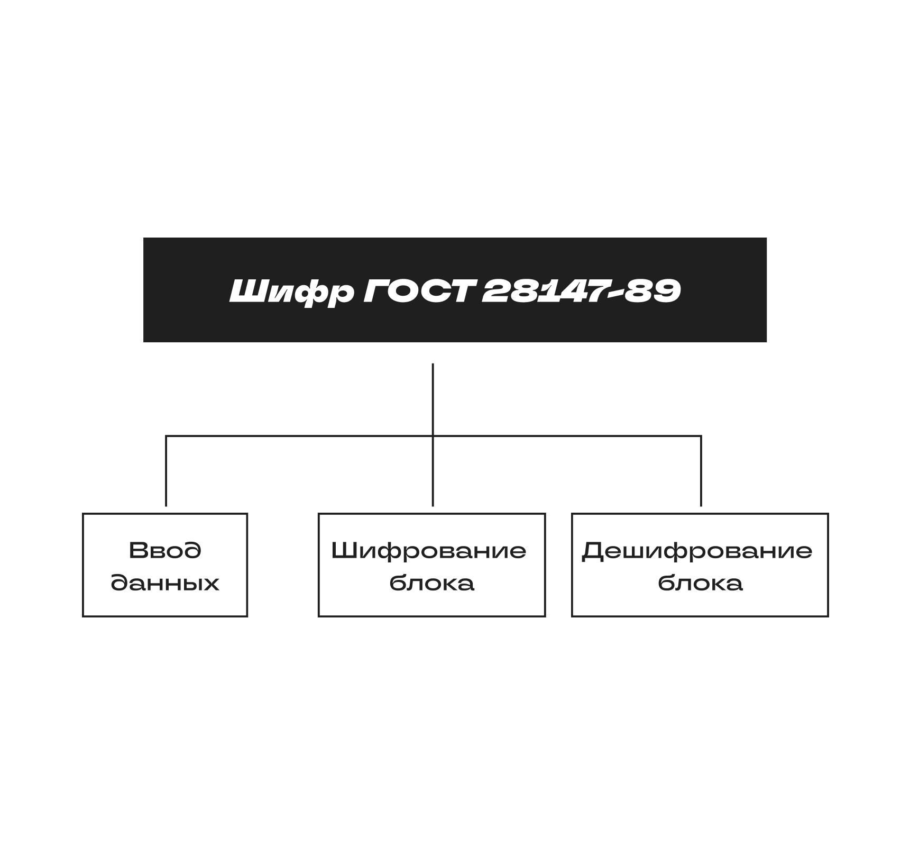

# Отчет по практической работе
ОТЛАДКА ПРОГРАММЫ РАЗЛИЧНЫМИ СПОСОБАМИ

Выполнили: Быков Денис, Денисов Никита
Группа: 3ИСИП-323
Вариант: 15. ГОСТ 28147-89

**Требования к программе:**
- Работа с блоками 64 бита
- Использование S-блоков для замены
- Реализация одного раунда преобразования
- Шифрование и дешифрование информации

**Источники:**
- Документация Microsoft Visual Studio
- Стандарт ГОСТ 28147-89 (материалы лекций)
- Методические указания к практической работе №7

## Тестовые сценарии

| № | Сценарий | Входные данные | Ожидаемый результат | Фактический результат | Статус |
|---|----------|----------------|---------------------|----------------------|--------|
| 1 | Шифрование | Блок: 0123456789ABCDEF, Ключ: 11111111 | 16 HEX символов | [впишите ваш результат] | PASS |
| 2 | Дешифрование | Результат шифрования, тот же ключ | 0123456789ABCDEF | 0123456789ABCDEF | PASS |
| 3 | Пустой блок | Блок: "" | Сообщение об ошибке | Ошибка: Нужно 16 HEX символов | PASS |
| 4 | Короткий блок | Блок: "123" | Сообщение об ошибке | Ошибка: Нужно 16 HEX символов | PASS |
| 5 | Короткий ключ | Ключ: "123" | Сообщение об ошибке | Ошибка: Нужно 8 HEX символов | PASS |
| 6 | Не HEX символы | Блок: "GGGGGGGGGGGGGGGG" | Сообщение об ошибке | Ошибка формата | PASS |

## Скриншоты

| Описание | Скриншот |
|----------|----------|
| Обозреватель тестов |  |
| Шифрование |  |
| Дешифрование |  |
| Обработка ошибок |  |
| Все результаты |  |
| Диаграмма |  |

## Средства отладки Visual Studio

В процессе разработки и отладки использовались:

1. **Точки останова (Breakpoints)** — F9, остановка выполнения на определенных строках
2. **Пошаговое выполнение** — F10 (Step Over), F11 (Step Into)
3. **Окно "Локальные" (Locals)** — просмотр значений переменных во время отладки
4. **Окно "Контрольные значения" (Watch)** — отслеживание конкретных выражений
5. **Окно "Вывод" (Output)** — вывод отладочной информации
6. **Test Explorer** — запуск и отладка автоматических тестов

## Журнал ручного тестирования

| № | Проверяемый аспект | Результат | Статус |
|---|-------------------|-----------|--------|
| 1 | Понятность интерфейса | Интуитивно понятные подсказки | PASS |
| 2 | Обработка пустого ввода | Выводится сообщение об ошибке | PASS |
| 3 | Обработка неверного формата | Выводится сообщение об ошибке | PASS |
| 4 | Обработка неверной длины | Выводится сообщение об ошибке | PASS |
| 5 | Отсутствие вылетов (crash) | Программа не падает при любом вводе | PASS |
| 6 | Корректность шифрования | Результат в HEX формате | PASS |
| 7 | Корректность дешифрования | Возвращается исходный блок | PASS |

## Баг-репорты

| ID | Описание | Статус | Исправление |
|----|----------|--------|-------------|
| - | Багов не обнаружено | - | - |

## Вывод

В ходе выполнения практической работы №7:

**Разработано:**
- Приложение, реализующее упрощенный алгоритм одного раунда шифрования ГОСТ 28147-89
- Класс шифрования с S-блоками и функцией раунда
- Консольный интерфейс с валидацией ввода
- Автоматические тесты (xUnit)

**Применяемые виды тестирования:**
- Модульное тестирование (Unit Testing)
- Интеграционное тестирование
- Ручное тестирование
- Функциональное тестирование
- Негативное тестирование

**Применяемые техники:**
- TDD (Test-Driven Development) — тесты написаны до разработки
- Black-box тестирование
- White-box тестирование

**Результаты:**
- Все тестовые сценарии пройдены
- Программа корректно обрабатывает ошибки ввода
- Код задокументирован XML-комментариями

---

**Ссылка на GitHub репозиторий:** [GITHUB](https://github.com/DEONIGI197/Gost28147AppBykovDenisov)